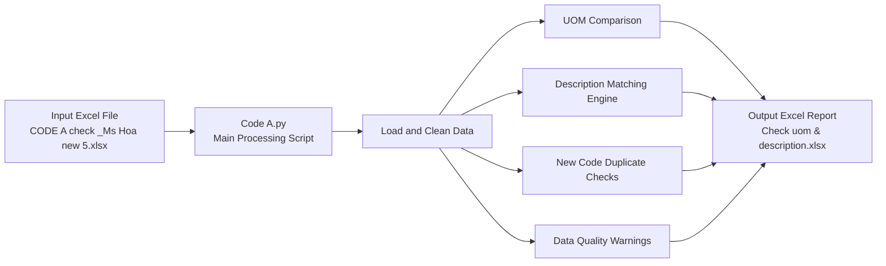

# BOM Data Preprocessing and Validation

A Python tool for preprocessing, validating, and comparing Bill of Materials (BOM) master data across three code systems:

- **Code A**
- **Ksys**
- **New Code**

The tool reads source data from Excel, compares UOM and descriptions, identifies potential data-quality issues, and exports a multi-sheet validation report.

# Features

- Compare UOM values between:
  - Code A and Ksys
  - Code A and New Code
- Compare item descriptions between:
  - Code A and Ksys
  - Code A and New Code
- Normalize descriptions before comparison, including:
  - Letter case and Vietnamese diacritics
  - Number formats
  - Voltage formats
  - Unit expressions
  - Common text variations
- Detect description differences such as:
  - Different item types
  - Different technical specifications
  - Different colors
  - Different origins or suppliers
  - Different content
- Apply a special comparison rule for Code A vs. Ksys:
  - Ksys descriptions are expected to match the portion of the Code A description after the first comma.
- Identify possible master-data issues:
  - One New Item assigned to multiple New Descriptions
  - One Code A item mapped to multiple New Items
  - Multiple New Items sharing matching or contained descriptions
  - Matching New Item descriptions with different UOM values
  - Repeated item names in descriptions
- Export all validation results to an Excel workbook.

# Project Structure

```text
Preprocessing_Data_BOMs/
├── Code A.py                         # Main BOM validation script
├── Check uom & description.xlsx      # Output report
└── README.md
```
# Architecture


# Requirements
Windows
Python 3.8 or later
Microsoft Excel or another application compatible with .xlsx files
Python packages: pip install pandas openpyxl

# Input File excel (.xlsx)
The input workbook must include the following columns:

Input Column	Internal Name
Item	item code A
Item Ksys	item ksys
Code mới	item new
Item Description / Spec	Description code A
Description Ksys	Description ksys
Spect mới	Description new
UOM	uom code A
UOM Ksys	uom ksys
Unit	uom new

# Output File
The script generates: 
`Check uom & description.xlsx`

The report includes these worksheets:

| Worksheet | Purpose |
|---|---|
| Lệch Desc (Code A vs New) | Description mismatches between Code A and New Code |
| Lệch Desc (Code A vs Ksys) | Actual description mismatches between Code A and Ksys |
| Lệch UOM (Code A vs Ksys) | UOM mismatches between Code A and Ksys |
| Lệch UOM (Code A vs New) | UOM mismatches between Code A and New Code |
| Toàn bộ Data Checked | Full processed dataset with validation results |
| Item New trùng Description | New Items sharing matching or contained descriptions |
| Item New nhiều Code A | New Items mapped to multiple Code A items |
| Lỗi 1 item new nhiều desc | A single New Item assigned to multiple descriptions |
| Item bị lặp Item Name | Repeated item-name patterns in descriptions |
| Cảnh báo dữ liệu | Data-quality warnings |

# Description Comparison Rules
Descriptions are normalized before comparison. The validation logic can identify:

Exact matches after normalization
Contained descriptions, where one description is more detailed
Item-name differences
Technical-specification differences
Color differences
Origin or supplier differences
Item-category differences
General content differences

# Data Exclusion Rules
The script excludes or treats certain data as unavailable, including:

Empty descriptions
N/A, NA, NULL, NONE, 0, or similar placeholder values
Placeholder codes such as all-zero values
Descriptions ending in VR, which are treated as variants in specific comparison scenarios
